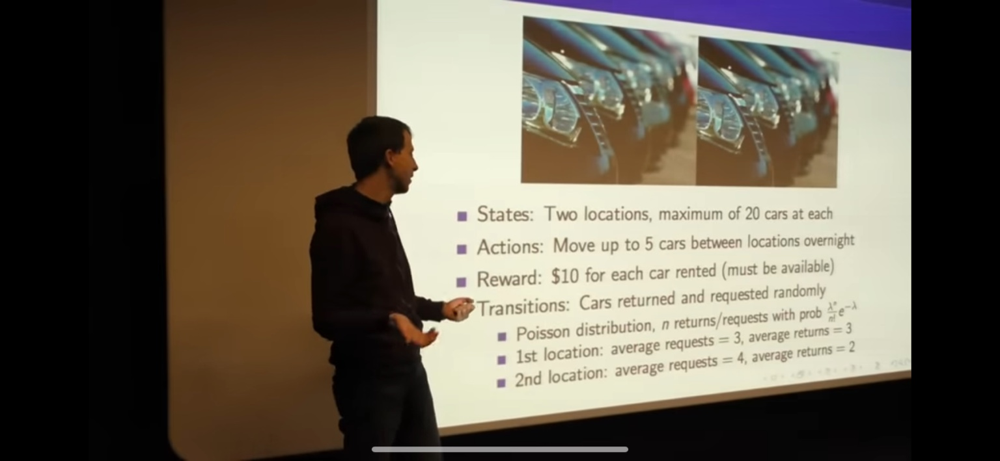

# David Silver's Car Rental Problem

- States: Two locations, maximum 20 cars per location
- Actions: Move cars from one location to another, maximum 5 cars per move
    - Action of 5 results in 5 cars moved from location 1 to location 2.
- Rewards: $10 for each car rented, only if the car is available
- Transitions: Car returned and requested are sampled from Poisson distributions:
    - Poisson distribution, n returns ($\lambda_r$) or requests ($\lambda_p$) with prob $\lambda^n e^{-\lambda} / n!$
    - Returns:
        - Location 1: $\lambda_r = 3$
        - Location 2: $\lambda_r = 2$
    - Requests:
        - Location 1: $\lambda_p = 3$
        - Location 2: $\lambda_p = 4$
    - Cost: $0 per car moved

## Intuition:
Location 1 gets lower average demand, with an equal distribution of demand and return rate.
Location 2 gets higher average demand, with more requests than returns.
This means that location 2 might run out of cars more often unless we move cars from location 1 to location 2.
We might expect to see an asymmetrical policy, with more cars moved from location 1 to location 2 when n_1 > n_2 than the other way around.

# Policy Iteration

1. Start with a simple policy: "Never move any cars" (all zeros)
2. **Policy evaluation**: Calculate values (total expected future rewards) for each state given by this policy. If I start in state X and follow this policy forever, how much reward do I expect to get?
    - `(20, 0)` should have low value, because location 2 can't rent any cars.
    - `(10,10)` should have good value because both locations can support a large demand.
    - Since no cars are moved by the policy, this establishes a base level of state quality with minimal intervention.
3. **Policy improvement**: Look at each state and now consider moving cars:
    - At `(20,0)` your current policy of "Never move any cars" now looks pretty poor. You might see that moving 5 cars is better than 0, because the value function determines that the state after moving 5 cars `(15, 5)` has higher value than the after moving 0.
    - At `(10, 10)` moving 0 cars might actually be optimal for now.
4. Repeat.

# Value Iteration

1. Start with zero value function.
2. Iteratively update the value function for each state using the Bellman optimality equation.
3. At each state, consider the value of taking each action.
4. Update the value function for the current state based on the value of the best action.
5. Repeat until the value function converges.