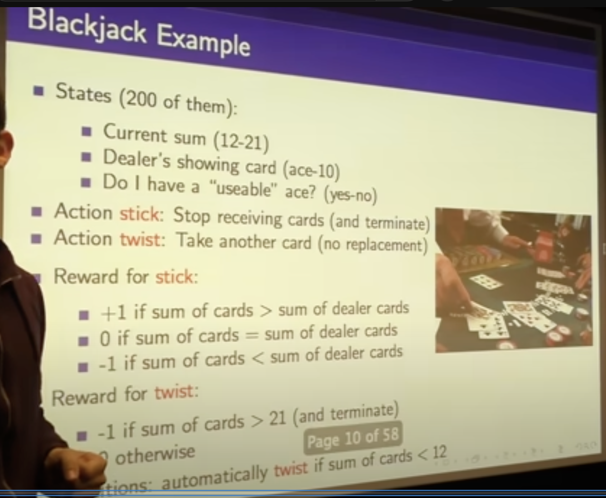

# Simplified Blackjack

## State space

1. Total value of the player's hand ($H\in [12, 21]$)
    - We ill auto-twist if we get lower than 12
2. The single card we can see in the dealer's hand (ace-10)
3. Whether the player has an ace that can be counted as 11 without busting. (yes/no)

## Action space

1. Stick - Stop receiving cards and terminate
2. Twist - Take another card

## Rewards

Stick:

- +1 if $H > H_{dealer}$
- 0 if $H = H_{dealer}$
- -1 if $H < H_{dealer}$

Twist:

$R=-1$ if $H > 21$ else 0
